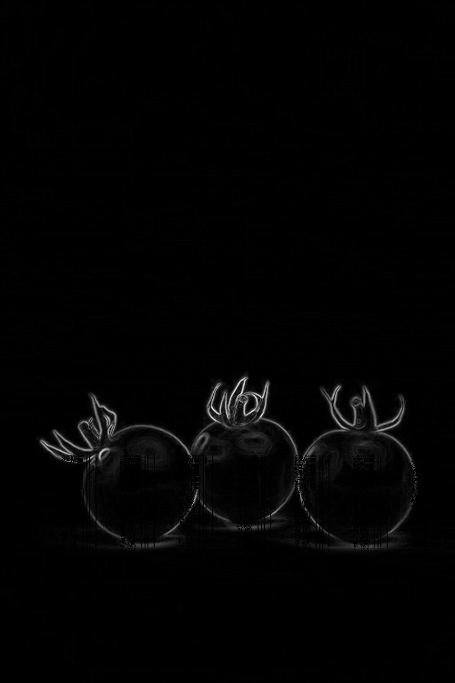

# Seam Carving — Content-Aware Image Resizing

A C++ implementation of the **Seam Carving** algorithm for content-aware image resizing, based on the paper *"Seam Carving for Content-Aware Image Resizing"* by Shai Avidan and Ariel Shamir (SIGGRAPH 2007).

Unlike standard resizing which uniformly squeezes all pixels, seam carving identifies and removes the least visually important paths of pixels — preserving edges, subjects, and high-detail regions while shrinking flat or homogeneous areas.

---

## Demo

### Content-Aware vs Standard Resize

| Original | Seam Carved (−200px width) |
|---|---|
|  |  |

> Seam carving removes flat water from the left. Both surfers stay intact. Standard resize would squish the entire image uniformly.

---

### Seam Carving in Action


> Each red line is the lowest-energy seam found by dynamic programming. Watch how seams avoid the subject and carve through the background.

---

### Vertical + Horizontal Seam Removal

| Original | −200px width, −100px height |
|---|---|
|  |  |

---

### Object Removal via Mask
##### The hot air balloon's basket gondola is removed. 

| Original | After Object Removal |
|---|---|
|  |  |


> User paints a white mask over the target region on a black canvas. Masked pixels receive artificially low energy (−10¹⁵), forcing every seam through them until the object disappears.

---

## How It Works

### Stage 1 — Energy Calculation

Every pixel is assigned an energy value measuring how visually important it is. Pixels on edges or subject boundaries have high energy. Flat backgrounds have low energy.

```
dx² = (R_right − R_left)² + (G_right − G_left)² + (B_right − B_left)²
dy² = (R_down  − R_up)²  + (G_down  − G_up)²  + (B_down  − B_up)²

energy(y, x) = sqrt(dx² + dy²)
```

This project implements and benchmarks two energy functions:

- **Simple Gradient** — uses left/right and up/down neighbors (4 pixels)
- **Sobel Filter** — uses all 8 surrounding pixels with weighted kernels, theoretically better at diagonal edges

#### Energy Map Visualization

The energy map below shows the ocean image processed through the energy function. Bright pixels = high energy (edges, subjects). Dark pixels = low energy (safe to remove).



#### Sobel Kernels

```
Gx (horizontal edges):    Gy (vertical edges):
-1  0  +1                 +1  +2  +1
-2  0  +2                  0   0   0
-1  0  +1                 -1  -2  -1

energy = sqrt(Gx² + Gy²)
```

---

### Stage 2 — Minimum Energy Seam (Dynamic Programming)

Finding the optimal seam is a classic shortest-path problem solved with DP.

**Why not greedy?** A greedy approach picks the cheapest neighbor at each step. This is fast but not optimal — it gets trapped in locally cheap paths that lead to expensive pixels later.

**Why DP works:** The minimum energy seam ending at pixel (y, x) depends only on the minimum energy seam ending at one of three pixels directly above it. This is optimal substructure.

```
dp[y][x] = energy[y][x] + min(
    dp[y−1][x−1],   // upper-left
    dp[y−1][x],     // directly above
    dp[y−1][x+1]    // upper-right
)
```

Two tables are maintained:
- `dp[y][x]` — minimum total energy of any seam reaching pixel (y, x) from the top
- `parent[y][x]` — which column above gave that minimum (used for backtracking the path)

#### Dry Run Example

```
Energy map:       DP table:          Parent table:
3   4   1         3   4   1          -   -   -
6   1   8         9   2   9          0   2   2
5   2   3         7   4   5          1   1   1

Minimum in last row = 4 at column 1
Backtrack: (2,1) → parent=1 → (1,1) → parent=2 → (0,2)
Seam path: col 2 → col 1 → col 1    Total energy = 1+1+2 = 4
```

Time complexity: **O(W × H)** per seam.

#### Seam Visualization

The red line below shows the first seam found on the ocean image — running between the flat water and the wave boundary, avoiding both surfers entirely.


---

### Stage 3 — Seam Removal

For each row, the seam pixel is deleted and everything to the right shifts left by one position. Width decreases by 1.

```cpp
for each row y:
    x = seam[y]
    for j from x to width-2:
        image[y][j] = image[y][j+1]
    width--
```

### Stage 4 — Energy Recalculation

After each removal, neighboring pixels change. The full energy map is recalculated before finding the next seam.

### Stage 5 — Repeat

```
while current_width > target_width:
    energy = computeEnergy(image)
    seam   = findMinSeam(energy)
    image  = removeSeam(image, seam)
```

---

### Horizontal Seam Removal

Horizontal seams reduce image height. The implementation transposes the pixel grid (swapping rows and columns), runs the identical vertical seam algorithm, then transposes back. Zero additional algorithm code needed.

### Object Removal

Masked pixels receive energy = −10¹⁵, making every seam pass through them until the masked region is fully consumed.

```cpp
if (mask[y][x]) energy[y][x] = -1e15;
```

The mask is a black PNG with white painted over the target region. Mask pixels and image pixels shift together during seam removal so alignment is maintained throughout.

---

## Energy Function Comparison

| | Simple Gradient | Sobel Filter |
|---|---|---|
| Neighbors sampled | 4 | 8 |
| Diagonal edge detection | Weak | Strong (weighted kernels) |
| Speed (287×175 image) | 0.60ms/seam | 0.70ms/seam |
| Speed (1916×1078 image) | 28.1ms/seam | 33.5ms/seam |
| Overhead | — | ~17-19% slower |

On high-contrast images (ocean, flat backgrounds), both methods produce near-identical seam paths. Sobel shows marginally better edge preservation on textured subjects like the penguin image below.

| Original | Simple Gradient (−50px) | Sobel (−50px) |
|---|---|---|
|  |  |  |

---

## Benchmarks

All benchmarks measured on Windows, Intel CPU, compiled with `g++ -O2`.

### Seam removal time vs image size

| Image Size | Seams | Time | Per Seam |
|---|---|---|---|
| 400 × 300 | 50 vertical | 0.061s | ~1.2ms |
| 287 × 175 | 50 vertical | 0.030s | ~0.60ms |
| 1916 × 1078 | 50 vertical | 1.29s | ~25.8ms |
| 1916 × 1078 | 200 vertical | 4.93s | ~24.6ms |
| 1916 × 1078 | 75V + 50H | 3.29s total | ~25ms |
| 1916 × 1078 | 200V + 200H | 7.85s total | ~25ms |

**Key observation:** Per-seam time stays roughly constant (~25ms) regardless of how many seams are removed. This confirms **O(W × H) per seam** complexity — linear in image area, as the theory predicts.

The 400×300 image runs ~20x faster per seam than the 1916×1078 image. The area ratio is also ~20x, confirming linear scaling with image size.

### PSNR vs Standard Resize

PSNR measures pixel-level similarity between seam-carved output and standard (uniform) resize of the same dimensions. Higher = more similar to original.

| Method | Image | Seams | PSNR (dB) |
|---|---|---|---|
| Simple Gradient | Penguin 287×175 | 50 | 11.62 |
| Sobel | Penguin 287×175 | 50 | 11.63 |

Both methods score ~11.6 dB against standard resize. This confirms that seam carving fundamentally changes the pixel selection strategy compared to uniform scaling — the energy function choice affects *where* seams go, not *how much* the image deviates from standard resize.

---

## Features

| Feature | Status |
|---|---|
| Vertical seam removal (width reduction) | done |
| Horizontal seam removal (height reduction) | done |
| Simple gradient energy function | done |
| Sobel filter energy function | done |
| Energy map visualization | done |
| Seam path visualization (red overlay) | done |
| Object removal via mask | done |
| GIF frame export | done |
| PSNR quality measurement | done |
| CLI interface | done |
| Input validation + error handling | done |

---

## Usage

```bash
# Build
g++ -O2 -std=c++17 src/main.cpp -o seamcarve

# Reduce width by 200px
./seamcarve input.png output.png 200 0

# Reduce width by 200px and height by 100px
./seamcarve input.png output.png 200 100

# Use Sobel energy function
./seamcarve input.png output.png 200 0 --sobel

# Save energy map visualization
./seamcarve input.png output.png 0 0 --save-energy

# Save GIF frames (stitched with FFmpeg after)
./seamcarve input.png output.png 100 0 --save-frames
ffmpeg -framerate 6 -i frames/frame_%d.png -vf "scale=960:-1" demo.gif

# Object removal (provide black PNG with white over target)
./seamcarve input.png output.png 0 0 images/mask.png --remove-object
```

---

## Project Structure

```
seam-carving/
├── src/
│   └── main.cpp          — full implementation
├── images/               — input images and masks
├── assets/               — output images for README
├── frames/               — GIF frame exports
├── stb_image.h           — single-header image loading
├── stb_image_write.h     — single-header image saving
└── README.md
```

---

## Dependencies

- **stb_image** / **stb_image_write** — single-header image I/O (no installation required, drop `.h` files in root)
- C++17 or later
- FFmpeg (optional, for GIF generation only)
- No other external dependencies

---

## References

1. Avidan, S., & Shamir, A. (2007). *Seam carving for content-aware image resizing*. ACM SIGGRAPH 2007. https://perso.crans.org/frenoy/matlab2012/seamcarving.pdf
2. Trekhleb — Content-aware image resizing in JavaScript. https://trekhleb.dev/blog/2021/content-aware-image-resizing-in-javascript/
3. Wikipedia — Seam carving. https://en.wikipedia.org/wiki/Seam_carving
4. Zucconi, A. (2023). Seam Carving in Unity. https://www.alanzucconi.com/2023/05/29/seam-carving/
5. Avik Das - Real-world dynamic programming: seam carving. https://avikdas.com/2019/05/14/real-world-dynamic-programming-seam-carving.html
---

## Future Work

- **Forward energy** — penalize seams that *create* new edges on removal, not just those with low existing energy (Rubinstein et al. 2008)
- **Seam insertion** — enlarge images by duplicating low-energy seams with averaged colors
- **Optimal seam ordering** — find the globally optimal sequence of horizontal and vertical removals (described in original paper)
- **Partial energy recalculation** — only recompute energy around the removed seam instead of the full image, reducing per-seam cost
