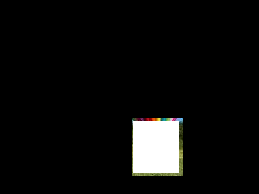
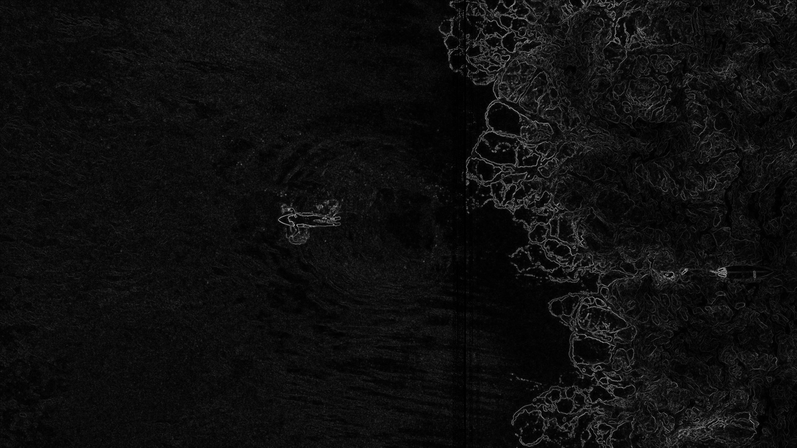
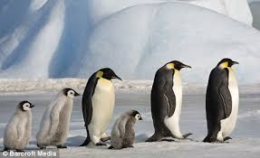
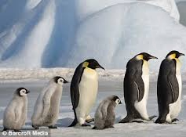
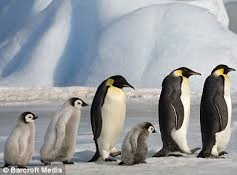

# Seam Carving — Content-Aware Image Resizing

A C++ implementation of the **Seam Carving** algorithm for content-aware image resizing, based on the paper *"Seam Carving for Content-Aware Image Resizing"* by Shai Avidan and Ariel Shamir (SIGGRAPH 2007).

Unlike standard resizing which uniformly squeezes all pixels, seam carving identifies and removes the least visually important paths of pixels — preserving edges, subjects, and high-detail regions while shrinking flat or homogeneous areas.

---

## Demo

### Seam Carving in Action


> Each red line is the lowest-energy seam found by dynamic programming. Watch how seams avoid the surfers and carve through the flat water background.

---

### Content-Aware Resizing

| Original (1916×1078) | −200px width | −200px width, −100px height |
|---|---|---|
|  |  |  |

> Seam carving removes flat water from the left. Both surfers stay intact across all reductions.

---

### Seam Insertion — Content-Aware Upscaling


| Original (1916×1078) | Upscaled +400px (2316×1078) |
|---|---|
|  |  |

> Seam insertion duplicates the lowest-energy seams and averages neighboring pixel colors for smooth blending. The ocean expands naturally while both surfers remain intact.

---

### Object Removal via Mask

| Original | Mask (white = remove) | After Removal |
|---|---|---|
|  | *(black canvas, white over gondola)* |  |

> The hot air balloon's basket gondola is removed. User creates a black PNG with white painted over the target region. Masked pixels receive energy = −10¹⁵, forcing every seam through them until the object disappears.

---

### Object Protection via Mask

| Original | Without Protection (−150px) | With Protection (−150px) |
|---|---|---|
|  |  |  |

> Protected pixels receive energy = +10¹⁵, making seams avoid them entirely. The tomatoes stay undistorted even at aggressive reductions.

---

### Forward Energy vs Backward Energy

Forward energy (Rubinstein et al. 2008) improves on the original algorithm by penalizing seams that *create* new visible edges after removal, not just seams with low existing energy.

| | Backward Energy (−150px) | Forward Energy (−150px) |
|---|---|---|
| **Tomato** |  |  |

> Forward energy produces smoother results — the tomatoes appear rounder with less color bleeding at seam boundaries. The difference is more visible at aggressive reductions (200px+).

| Backward Energy (-150px) | Forward Energy (−150x) |
|---|---|
|  |  |

**Measured improvement  150 seams:**

| Energy Function | PSNR vs Standard Resize | Time per Seam |
|---|---|---|
| Backward (simple gradient) | 16.421 dB | 3.20303ms |
| Forward | 15.668 dB | 4.21506ms |
> forward energy is slower
> even though forward energy smoothens and blends there might be some distortion that may arise.

---

### Energy Map Visualization

| Image | Energy Map |
|---|---|
|  |  |

> Bright pixels = high energy (edges, subjects = preserve). Dark pixels = low energy (flat regions = safe to remove). The flat turquoise water on the left is nearly pure black — exactly where seams carve through.

---

### Energy Function Comparison: Simple Gradient vs Sobel

| Original | Simple Gradient (−50px) | Sobel Filter (−50px) |
|---|---|---|
|  |  |  |

| | Simple Gradient | Sobel Filter |
|---|---|---|
| Neighbors sampled | 4 | 8 |
| Diagonal edge detection | Weak | Strong (weighted kernels) |
| Speed (287×175) | 0.60ms/seam | 0.70ms/seam |
| Speed (1916×1078) | 28.1ms/seam | 33.5ms/seam |
| PSNR (287×175, 50 seams) | 11.62 dB | 11.63 dB |
| Overhead | — | ~17-19% slower |

> Sobel samples all 8 surrounding pixels using weighted kernels, making it theoretically better at diagonal edges. On high-contrast images (flat backgrounds), both methods produce near-identical results. Sobel shows marginally better edge preservation on mid-contrast textured subjects.

---

## How It Works

### Stage 1 — Energy Calculation

Every pixel is assigned an energy value measuring how visually important it is.

```
dx² = (R_right − R_left)² + (G_right − G_left)² + (B_right − B_left)²
dy² = (R_down  − R_up)²  + (G_down  − G_up)²  + (B_down  − B_up)²

energy(y, x) = sqrt(dx² + dy²)
```

High energy = sharp color change = edge or important detail.  
Low energy = flat region = safe to remove.

#### Sobel Filter (advanced energy)

```
Gx (horizontal edges):    Gy (vertical edges):
-1  0  +1                 +1  +2  +1
-2  0  +2                  0   0   0
-1  0  +1                 -1  -2  -1

energy = sqrt(Gx² + Gy²)
```

#### Forward Energy (Rubinstein et al. 2008)

Unlike backward energy which measures existing pixel energy, forward energy measures the cost of new edges *created* when a seam is removed.

```
CU = |pixel[y][x+1] - pixel[y][x-1]|           (new horizontal edge created)
CL = |pixel[y-1][x] - pixel[y][x-1]| + CU      (cost from upper-left)
CR = |pixel[y-1][x] - pixel[y][x+1]| + CU      (cost from upper-right)

dp[y][x] = min(
    dp[y-1][x-1] + CL,
    dp[y-1][x]   + CU,
    dp[y-1][x+1] + CR
)
```

This penalizes seams that leave visible artifacts after removal, producing cleaner results on structured subjects.

---

### Stage 2 — Minimum Energy Seam (Dynamic Programming)

Finding the optimal seam is a classic shortest-path problem solved with DP.

**Why not greedy?** Greedy picks the cheapest neighbor at each step but gets trapped in locally cheap paths that lead to expensive pixels later. DP considers all possible paths implicitly.

**Why DP works:** The minimum energy seam ending at pixel (y, x) depends only on the minimum energy seam ending at one of three pixels directly above it — optimal substructure.

```
dp[y][x] = energy[y][x] + min(
    dp[y−1][x−1],   // upper-left
    dp[y−1][x],     // directly above
    dp[y−1][x+1]    // upper-right
)
```

Two tables maintained:
- `dp[y][x]` — minimum total energy of any seam reaching (y, x) from the top
- `parent[y][x]` — which column above gave that minimum (for path backtracking)

#### Dry Run

```
Energy map:       DP table:          Parent table:
3   4   1         3   4   1          -   -   -
6   1   8         9   2   9          0   2   2
5   2   3         7   4   5          1   1   1

Min in last row = 4 at col 1
Backtrack: (2,1)→(1,1)→(0,2)
Path: col 2 → col 1 → col 1    Total energy = 1+1+2 = 4 ✓
```

Time complexity: **O(W × H)** per seam.

#### Seam Visualization


> The red line shows the first seam found — it runs along the boundary between flat water and waves, avoiding both surfers entirely.

---

### Stage 3 — Seam Removal

```cpp
for each row y:
    x = seam[y]
    for j from x to width-2:
        image[y][j] = image[y][j+1]
    width--
```

### Stage 4 — Energy Recalculation

After each removal, neighboring pixels change. Full energy map is recalculated before the next seam.

### Stage 5 — Repeat

```
while current_width > target_width:
    energy = computeEnergy(image)
    seam   = findMinSeam(energy)
    image  = removeSeam(image, seam)
```

---

### Horizontal Seam Removal

Height reduction uses the same algorithm. The pixel grid is transposed (rows ↔ columns), vertical seam logic runs unchanged, then the grid is transposed back. Zero additional algorithm code.

### Seam Insertion (Upscaling)

To enlarge an image content-aware:
1. Find k lowest-energy seams (without removing them)
2. Insert a new pixel beside each seam, averaged with neighbors
3. Track insertion offsets so earlier insertions don't misalign later seams

```cpp
pixel newpx = {
    (left.r + right.r) / 2,
    (left.g + right.g) / 2,
    (left.b + right.b) / 2
};
pixels[y].insert(pixels[y].begin() + x + 1, newpx);
```

### Object Removal

Masked pixels receive energy = −10¹⁵, making every seam pass through them:

```cpp
if (mask[y][x]) energy[y][x] = -1e15;
```

### Object Protection

Protected pixels receive energy = +10¹⁵, making seams avoid them:

```cpp
if (protect_mask[y][x]) energy[y][x] = 1e15;
```

---

## Benchmarks

All benchmarks on Windows, Intel CPU, `g++ -O2`.

### Seam removal time vs image size

| Image Size | Seams | Time | Per Seam |
|---|---|---|---|
| 287 × 175 | 50 vertical | 0.030s | ~0.60ms |
| 400 × 300 | 50 vertical | 0.061s | ~1.2ms |
| 1916 × 1078 | 50 vertical | 1.29s | ~25.8ms |
| 1916 × 1078 | 200 vertical | 4.93s | ~24.6ms |
| 1916 × 1078 | 75V + 50H | 3.29s | ~25ms avg |
| 1916 × 1078 | 200V + 200H | 7.85s | ~25ms avg |

**Key observation:** Per-seam time stays roughly constant (~25ms) regardless of how many seams are removed, confirming **O(W × H)** complexity. The 400×300 image is ~20x faster than 1916×1078 — the area ratio is also ~20x, confirming linear scaling.

### Forward vs Backward Energy

| Energy | Image | Seams | PSNR (dB) | Time/seam |
|---|---|---|---|---|
| Backward (simple) | Tomato 500×750 | 150 | 19.84 | 4.24ms |
| Forward | Tomato 500×750 | 150 | 20.06 | 5.37ms |
| Simple gradient | Penguin 287×175 | 50 | 11.62 | 0.60ms |
| Sobel | Penguin 287×175 | 50 | 11.63 | 0.70ms |

---

## Features

| Feature |
|---|
| Vertical seam removal (width reduction) |
| Horizontal seam removal (height reduction) |
| Seam insertion / content-aware upscaling |
| Simple gradient energy function |
| Sobel filter energy function |
| Forward energy (Rubinstein et al. 2008) |
| Object removal via low-energy mask |
| Object protection via high-energy mask |
| Energy map visualization |
| Seam path visualization (red overlay) |
| GIF frame export (removal + upscaling) |
| PSNR quality measurement |
| CLI interface with flags |
| Input validation + error handling |

---

## Known Limitations

- **Faces and structured subjects** — seam carving can distort faces since the energy function may route seams through them at aggressive reduction levels. Works best with a clear subject against a flat background.
- **Large reductions** — removing more than ~30% of width/height causes visible artifacts as the algorithm exhausts low-energy seams and begins cutting into content.
- **Upscaling artifacts** — inserting too many seams at once causes stretching in concentrated regions. Keep upscaling below ~30% of original width for best results.
- **Textured backgrounds** — uniformly high-energy backgrounds (grass, sand, crowds) make it harder to find clean seams.
- **Object removal quality** — works best on objects surrounded by flat uniform regions. Objects near other high-energy areas may leave artifacts.

---

## Usage

```bash
# Build
g++ -O2 -std=c++17 src/main.cpp -o seamcarve

# Reduce width by 200px
./seamcarve input.png output.png 200 0

# Reduce width + height
./seamcarve input.png output.png 200 100

# Upscale width by 200px (pass 0 0 for no removal)
./seamcarve input.png output.png 0 0 --upscale 200

# Use Sobel energy function
./seamcarve input.png output.png 200 0 --sobel

# Use forward energy (Rubinstein 2008)
./seamcarve input.png output.png 200 0 --forward

# Save energy map
./seamcarve input.png output.png 0 0 --save-energy

# Export GIF frames
./seamcarve input.png output.png 100 0 --save-frames
ffmpeg -framerate 6 -i frames/frame_%d.png -vf "scale=960:-1" demo.gif

# Object removal (black PNG, white over target region)
./seamcarve input.png output.png 0 0 --mask images/mask.png --remove-object

# Object protection (black PNG, white over region to keep)
./seamcarve input.png output.png 200 0 --protect images/protect.png

# Combine: protect tomatoes while resizing
./seamcarve input.png output.png 150 0 --protect images/protect.png --forward
```

---

## Project Structure

```
seam-carving/
├── src/
│   └── main.cpp          — full implementation (~700 lines)
├── images/               — input images and masks
├── assets/               — output images for README
├── frames/               — GIF frame exports
├── stb_image.h           — single-header image loading (no install)
├── stb_image_write.h     — single-header image saving (no install)
└── README.md
```

---

## Dependencies

- **stb_image / stb_image_write** — single-header image I/O, drop `.h` files in root, no installation
- C++17 or later
- FFmpeg (optional, GIF generation only)
- No other external dependencies

---

## References

1. Avidan, S., & Shamir, A. (2007). *Seam carving for content-aware image resizing*. ACM SIGGRAPH 2007. https://perso.crans.org/frenoy/matlab2012/seamcarving.pdf
2. Rubinstein, M., Shamir, A., & Avidan, S. (2008). *Improved seam carving for video retargeting*. ACM SIGGRAPH 2008.
3. Trekhleb — Content-aware image resizing in JavaScript. https://trekhleb.dev/blog/2021/content-aware-image-resizing-in-javascript/
4. Wikipedia — Seam carving. https://en.wikipedia.org/wiki/Seam_carving
5. Zucconi, A. (2023). Seam Carving in Unity. https://www.alanzucconi.com/2023/05/29/seam-carving/
6. Avik Das — Real-world dynamic programming: seam carving. https://avikdas.com/2019/05/14/real-world-dynamic-programming-seam-carving.html

---

## Future Work

- **Optimal seam ordering** — find the globally optimal sequence of H and V removals (described in original paper as a separate DP problem)
- **Partial energy recalculation** — only recompute energy around the removed seam instead of full image, reducing per-seam cost significantly
- **Web version** — TypeScript port with React frontend for browser-based interactive demo (in progress on `web` branch)
- **GIF support** — apply seam carving to animated GIFs frame-by-frame with consistent seam paths