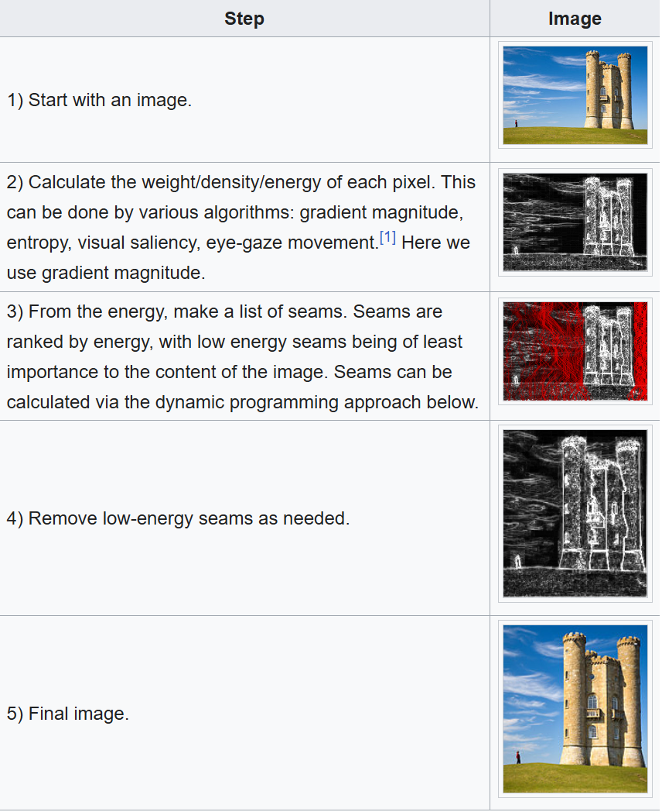
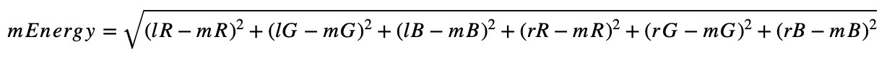

seam carving | liquid resizing
algorithim : context-aware image resizing

developed by Shai Avidan, of Mitsubishi Electric Research Laboratories (MERL), and Ariel Shamir, of the Interdisciplinary Center and MERL. 

It functions by establishing a number of seams (paths of least importance) in an image and automatically removes seams to reduce image size or inserts seams to extend it.

 Seam carving also allows manually defining areas in which pixels may not be modified, and features the ability to remove whole objects from photographs.

 The purpose of the algorithm is image retargeting, which is the problem of displaying images without distortion on media of various sizes (cell phones, projection screens) using document standards, like HTML, that already support dynamic changes in page layout and text but not images.[1]

seam carving - image resize - by removing least important - connected pixel paths 
- instead of blindly squeezing whole image
example
[ sky ][ sky ][ sky ][ person ][ sky ][ sky ]
reduce width

That is why it is called content-aware resizing. It is aware of image content instead of treating every pixel equally.

seam ? connected path of pixels
for reducing width 
weremove verical seamA vertical seam goes from top to bottom, taking one pixel from every row:

row 0:        x
row 1:       x
row 2:        x
row 3:         x
row 4:        x

It is not necessarily a straight line. It can wiggle left/right, but slowly.

In matrix terms, from row y to row y + 1, the next pixel can be:

down-left:  (y+1, x-1)
down:       (y+1, x)
down-right: (y+1, x+1)

computer doesnt know this important or what not is 
so each pixel is given an energy value
energy value indicates how important this pixel is
high energy = edge/detail/obj/text/face boundary
low energy = smooth sky/wall/grass/background

Colors change sharply, so energy is high.

Trekhleb’s explanation calculates pixel energy using color differences between neighboring pixels, based on RGB/RGBA values. Higher energy pixels are more likely to be edges and therefore less likely to be removed.

energy map ?
image is just a matrix of pixel
example :
Pixel matrix:
(0,0) (0,1) (0,2)
(1,0) (1,1) (1,2)
(2,0) (2,1) (2,2)

after this calc energy of each pixel
energy map
10   50   20
5    100  15
8    60   12

5 indicating least important
100 indicating most important

So seam carving tries to find a path from top to bottom with minimum total energy.

why DP ?
minimum energy path from top to bottom - DP 
for every pixel : (y,x) it asks ?
what is the minimum cost seam that reaches this pixel

formula !!!
dp[y][x] = energy[y][x] + min(
    dp[y-1][x-1],
    dp[y-1][x],
    dp[y-1][x+1]
);
along with boundary checks needed for first and last column
after filling dp table
the minimum value in the last row gives the end of the best seam

for each pixel
you add current energy to the minimum of the three possible previous seam energies above it
after filling the table you backtrack from the lowest value in the bottom row

dry run :
(small)
energy map is :
Row 0:  3   4   1
Row 1:  6   1   8
Row 2:  5   2   3

dp row 0: 3 4 1
for row 1
dp[1][0] = 6 + min(3,4) = 9
dp[1][1] = 6+min(3,4,1) = 2
dp[2][1] = 8 + min(4,1) = 9
so 
dp row 1 : 9 2 9

for row 2:
dp[2][0] = 5+min(9,2) = 7
dp[2][1] = 2+min(9,2,9) = 4
dp[2][2] = 3+min(2,9) = 5

so final dp becomes

3   4   1
9   2   9
7   4   5

so minimum last row is 4
so best seam ends at row 2 col 1

this seam has energy as
1 + 1 + 2 = 4 
02 - 11 - 21 path 
which is the least important path

after finding seam ??
you remove 1 pixel from each row
example 
A B C D E
if seam pixel is C
A B D E

do this for every row
now image width reduces by 1
To reduce width by 100 repeat this process 100 times

PROCESS
1. calculate energy
2. remove seam
3. calcualting energy again
4. find next seam again
5. remove seam

it goes on!!
The Trekhleb article also describes seam deletion as shifting pixels to the right of the seam one position left.

why theres a need to recalcualte energy again and again ??

because after removing a seam neigbouring pixels change
before removing
A B C D E
after removing
A B D E
now b and d becomes neighbours
so energy changes
think of it, the whole matrix changes
so normal or simple way is to recalcualte the full energy again after each seam removal
but this is not optimal
optimal is when we recalcalte only around the remove seam

part 2
inserting seams
- to increase image size
to enlarge width :
find low energy seam
instead of deleting it, duplicate it
maybe avergae it colours with neighbours so it blends

example
A B C D
insert seam after B
A B B' C D
Where B' is similar to B.
This increases width by 1.
The original paper describes seam carving as supporting both reduction and expansion; a seam is an optimal connected path, and repeated removal/insertion changes aspect ratio.

part 3 !
object removal !! 

Suppose user marks an object to remove:

[ sky ][ sky ][ unwanted object ][ sky ]

create a mask over that object
and then artifically make that maked region have very low energy like -100000
energy[y][x] = -1e9;
now algo works 
like thinking
the region is useless
should remove seams from here 
so seams start passing through the object againa and again 
enetually object disappers
Trekhleb’s repo/article describes object removal this way: if pixels are given artificially low energy using a mask, seam carving can remove that region during resizing.

part 4 !!
protect mask
if u dont want some area to be removed
give it exceptionally high energy
energy[y][x] = 1e9;

part 5 !!!
image retargetingg!!!
make the same image fit at different screen shape without making it ugly
example :
original image :
wide desktop image: 1920 x 1080
Need to fit:
phone screen / square post / banner / thumbnail

Normal resizing may distort it. Cropping may cut important parts. Seam carving tries to change the size while preserving important content.
Wikipedia describes image retargeting as displaying images without distortion on different media sizes, such as phones or projection screens.

for each pixel :
energy[y][x] = color difference with left/right/up/down neighbors;
dx = difference between left and right pixel
dy = difference between up and down pixel
energy = sqrt(dx + dy)

vector<vector<double>> dp(height, vector<double>(width));
vector<vector<int>> parent(height, vector<int>(width));

then

dp[y][x] = energy[y][x] + min(previous 3 cells)

Stage 4: Remove seam

For each row, remove one pixel:

for each row y:
    seamX = seam[y]
    shift pixels after seamX left by 1
width--

Stage 5: Repeat
while (width > targetWidth) {
    energy = computeEnergy(image);
    seam = findMinSeam(energy);
    removeSeam(image, seam);
}

That is the full core project.

[got it from chatgpt above formaulas]

wikipedia
Seams can be either vertical or horizontal. 
vertical seam is a path of pixels connected from top to bottom in an image with one pixel in each row.
 A horizontal seam is similar with the exception of the connection being from left to right. 
 imp
`The importance/energy function values a pixel by measuring its contrast with its neighbor pixels.`

process as per wikipedia
1) Start with an image.
2) Calculate the weight/density/energy of each pixel. This can be done by various algorithms: gradient magnitude, entropy, visual saliency, eye-gaze movement.[1] Here we use gradient magnitude.
3) From the energy, make a list of seams. Seams are ranked by energy, with low energy seams being of least importance to the content of the image. Seams can be calculated via the dynamic programming approach below.
4) Remove low-energy seams as needed.
5) Final image.

Computing a seam consists of finding a path of minimum energy cost from one end of the image to another. This can be done via Dijkstra's algorithm, dynamic programming, greedy algorithm or graph cuts among others.[1]

However, the problem of making multiple seams at the same time is harder for two reasons: the energy needs to be regenerated for each removal for correctness and simply tracing back multiple seams can form overlaps

. Avidan 2007 computes all seams by removing each seam iteratively and storing an "index map" to record all the seams generated. The map holds a "nth seam" number for each pixel on the image, and can be used later for size adjustmen

If one ignores both issues however, a greedy approximation for parallel seam carving is possible. To do so, one starts with the minimum-energy pixel at one end, and keep choosing the minimum energy path to the other end. The used pixels are marked so that they are not picked again.[3] Local seams can also be computed for smaller parts of the image in parallel for a good approximation.[4]

Issues
1. The algorithm may need user-provided information to reduce errors. 
This can consist of painting the regions which are to be preserved.
 With human faces it is possible to use face detection.
2. Sometimes the algorithm, by removing a low energy seam, may end up inadvertently creating a seam of higher energy.
 The solution to this is to simulate a removal of a seam, and then check the energy delta to see if the energy increases (forward energy). If it does, prefer other seams instead.[5]

https://trekhleb.dev/blog/2021/content-aware-image-resizing-in-javascript/
To avoid changing the important parts of the image we may find the continuous sequence of pixels (the seam), that goes from top to bottom and has the lowest contribution to the content of the image (avoids important parts) and then remove it. The seam removal will shrink the image by 1 pixel. We will then repeat this step until the image will get the desired width.

The question is how to define the importance of the pixel and its contribution to the content (in the original paper the authors are using the term energy of the pixel). One of the ways to do it is to treat all the pixels that form the edges as important ones. In case if a pixel is a part of the edge its color would have a greater difference between the neighbors (left and right pixels) than the pixel that isn't a part of the edge.

Assuming that the color of a pixel is represented by 4 numbers (R - red, G - green, B - blue, A - alpha) we may use the following formula to calculate the color difference (the pixel energy):

mEnergy = 1(IR-mR)2 +(IG - mG)2 + (IB -mB)2 + (rR -mR)2 + (rG -mG)2 + (rB - mB)2
formual
mEnergy - Energy (importance) of the middle pixel ([0..626] if rounded)
lR - Red channel value for the left pixel ([0..255])
mR - Red channel value for the middle pixel ([0..255])
rR - Red channel value for the right pixel ([0..255])
lG - Green channel value for the left pixel ([0..255])
In the formula above we're omitting the alpha (transparency) channel, for now, assuming that there are no transparent pixels in the image. Later we will use the alpha channel for masking and for object removal.

To visualize the energy map we may assign a brighter color to the pixels with the higher energy and darker colors to the pixels with the lower energy. Here is an artificial example of how the random part of the energy map might look like. You may see the bright line which represents the edge and which we want to preserve during the resizing.

Calculating the pixel's energy
Here we apply the color difference formula described above. For the left and right borders (when there are no left or right neighbors), we ignore the neighbors and don't take them into account during the energy calculation.

// Calculates the energy of a pixel.
const getPixelEnergy = (left: Color | null, middle: Color, right: Color | null): number => {
  // Middle pixel is the pixel we're calculating the energy for.
  const [mR, mG, mB] = middle;

  // Energy from the left pixel (if it exists).
  let lEnergy = 0;
  if (left) {
    const [lR, lG, lB] = left;
    lEnergy = (lR - mR) ** 2 + (lG - mG) ** 2 + (lB - mB) ** 2;
  }

  // Energy from the right pixel (if it exists).
  let rEnergy = 0;
  if (right) {
    const [rR, rG, rB] = right;
    rEnergy = (rR - mR) ** 2 + (rG - mG) ** 2 + (rB - mB) ** 2;
  }

  // Resulting pixel energy.
  return Math.sqrt(lEnergy + rEnergy);
};

Calculating the energy map
The image we're working with has the ImageData format. It means that all the pixels (and their colors) are stored in a flat (1D) Uint8ClampedArray array. For readability purposes let's introduce the couple of helper functions that will allow us to work with the Uint8ClampedArray array as with a 2D matrix instead.

// Helper function that returns the color of the pixel.
const getPixel = (img: ImageData, { x, y }: Coordinate): Color => {
  // The ImageData data array is a flat 1D array.
  // Thus we need to convert x and y coordinates to the linear index.
  const i = y * img.width + x;
  const cellsPerColor = 4; // RGBA
  // For better efficiency, instead of creating a new sub-array we return
  // a pointer to the part of the ImageData array.
  return img.data.subarray(i * cellsPerColor, i * cellsPerColor + cellsPerColor);
};

// Helper function that sets the color of the pixel.
const setPixel = (img: ImageData, { x, y }: Coordinate, color: Color): void => {
  // The ImageData data array is a flat 1D array.
  // Thus we need to convert x and y coordinates to the linear index.
  const i = y * img.width + x;
  const cellsPerColor = 4; // RGBA
  img.data.set(color, i * cellsPerColor);
};
To calculate the energy map we go through each image pixel and call the previously described getPixelEnergy() function against it.

// Helper function that creates a matrix (2D array) of specific
// size (w x h) and fills it with specified value.
const matrix = <T>(w: number, h: number, filler: T): T[][] => {
  return new Array(h)
    .fill(null)
    .map(() => {
      return new Array(w).fill(filler);
    });
};

// Calculates the energy of each pixel of the image.
const calculateEnergyMap = (img: ImageData, { w, h }: ImageSize): EnergyMap => {
  // Create an empty energy map where each pixel has infinitely high energy.
  // We will update the energy of each pixel.
  const energyMap: number[][] = matrix<number>(w, h, Infinity);
  for (let y = 0; y < h; y += 1) {
    for (let x = 0; x < w; x += 1) {
      // Left pixel might not exist if we're on the very left edge of the image.
      const left = (x - 1) >= 0 ? getPixel(img, { x: x - 1, y }) : null;
      // The color of the middle pixel that we're calculating the energy for.
      const middle = getPixel(img, { x, y });
      // Right pixel might not exist if we're on the very right edge of the image.
      const right = (x + 1) < w ? getPixel(img, { x: x + 1, y }) : null;
      energyMap[y][x] = getPixelEnergy(left, middle, right);
    }
  }
  return energyMap;
};
The energy map is going to be recalculated on every resize iteration. It means that it will be recalculated, let's say, 500 times if we need to shrink the image by 500 pixels which is not optimal. To speed up the energy map calculation on the 2nd, 3rd, and further steps, we may re-calculate the energy only for those pixels that are placed around the seam that is going to be removed. For simplicity reasons this optimization is omitted here, but you may find the example source-code in js-image-carver repo.

Finding the seam with the lowest energy (Dynamic Programming approach)

The naive approach
The naive approach would be to check all possible paths one after another.
Going from top to bottom, for each pixel, we have 3 options (↙︎ go down-left, ↓ go down, ↘︎ go down-right). This gives us the time complexity of O(w * 3^h) or simply O(3^h), where w and h are the width and the height of the image. This approach looks slow.

The greedy approach
We may also try to choose the next pixel as a pixel with the lowest energy, hoping that the resulting seam energy will be the smallest one.
This approach gives not the worst solution, but it cannot guarantee that we will find the best available solution. On the image above you may see how the greedy approach chose 5 instead of 10 at first and missed the chain of optimal pixels.

The good part about this approach is that it is fast, and it has a time complexity of O(w + h), where w and h are the width and the height of the image. In this case, the cost of the speed is the low quality of resizing. We need to find a minimum value in the first row (traversing w cells) and then we explore only 3 neighbor pixels for each row (traversing h rows).

The dynamic programming approach

This fact that we're re-using the energy of the previous seam to calculate the current seam's energy might be applied recursively to all the shorter seams up to the very top 1st row seam. When we have such overlapping sub-problems, it is a sign that the general problem might be optimized by dynamic programming approach.

So, we may save the energy of the current seam at the particular pixel in an additional seamsEnergies table to make it re-usable for calculating the next seams faster (the seamsEnergies table will have the same size as the energy map and the image itself).

Let's also keep in mind that for one particular pixel on the image (i.e. the bottom left one) we may have several values of the previous seams energies.

You may think about it this way:

The cell [1][x]: contains the lowest possible energy of the seam that starts somewhere on the row [0][?] and ends up at cell [1][x]
The current cell [2][3]: contains the lowest possible energy of the seam that starts somewhere on the row [0][?] and ends up at cell [2][3]. To calculate it we need to sum up the energy of the current pixel [2][3] (from the energy map) with the min(seam_energy_1_2, seam_energy_1_3, seam_energy_1_4)
If we fill the seamsEnergies table completely, then the minimum number in the lowest row would be the lowest possible seam energy.

After filling out the seamsEnergies table we may see that the lowest energy pixel has an energy of 50. For convenience, during the seamsEnergies generation for each pixel, we may save not only the energy of the seam but also the coordinates of the previous lowest energy seam. This will give us the possibility to reconstruct the seam path from the bottom to the top easily.

The time complexity of DP approach would be O(w * h), where w and h are the width and the height of the image. We need to calculate energies for every pixel of the image.

Here is an example of how this logic might be implemented:
// The metadata for the pixels in the seam.
type SeamPixelMeta = {
  energy: number, // The energy of the pixel.
  coordinate: Coordinate, // The coordinate of the pixel.
  previous: Coordinate | null, // The previous pixel in a seam.
};

// Finds the seam (the sequence of pixels from top to bottom) that has the
// lowest resulting energy using the Dynamic Programming approach.
const findLowEnergySeam = (energyMap: EnergyMap, { w, h }: ImageSize): Seam => {
  // The 2D array of the size of w and h, where each pixel contains the
  // seam metadata (pixel energy, pixel coordinate and previous pixel from
  // the lowest energy seam at this point).
  const seamsEnergies: (SeamPixelMeta | null)[][] = matrix<SeamPixelMeta | null>(w, h, null);

  // Populate the first row of the map by just copying the energies
  // from the energy map.
  for (let x = 0; x < w; x += 1) {
    const y = 0;
    seamsEnergies[y][x] = {
      energy: energyMap[y][x],
      coordinate: { x, y },
      previous: null,
    };
  }

  // Populate the rest of the rows.
  for (let y = 1; y < h; y += 1) {
    for (let x = 0; x < w; x += 1) {
      // Find the top adjacent cell with minimum energy.
      // This cell would be the tail of a seam with lowest energy at this point.
      // It doesn't mean that this seam (path) has lowest energy globally.
      // Instead, it means that we found a path with the lowest energy that may lead
      // us to the current pixel with the coordinates x and y.
      let minPrevEnergy = Infinity;
      let minPrevX: number = x;
      for (let i = (x - 1); i <= (x + 1); i += 1) {
        if (i >= 0 && i < w && seamsEnergies[y - 1][i].energy < minPrevEnergy) {
          minPrevEnergy = seamsEnergies[y - 1][i].energy;
          minPrevX = i;
        }
      }

      // Update the current cell.
      seamsEnergies[y][x] = {
        energy: minPrevEnergy + energyMap[y][x],
        coordinate: { x, y },
        previous: { x: minPrevX, y: y - 1 },
      };
    }
  }

  // Find where the minimum energy seam ends.
  // We need to find the tail of the lowest energy seam to start
  // traversing it from its tail to its head (from the bottom to the top).
  let lastMinCoordinate: Coordinate | null = null;
  let minSeamEnergy = Infinity;
  for (let x = 0; x < w; x += 1) {
    const y = h - 1;
    if (seamsEnergies[y][x].energy < minSeamEnergy) {
      minSeamEnergy = seamsEnergies[y][x].energy;
      lastMinCoordinate = { x, y };
    }
  }

  // Find the lowest energy energy seam.
  // Once we know where the tail is we may traverse and assemble the lowest
  // energy seam based on the "previous" value of the seam pixel metadata.
  const seam: Seam = [];
  if (!lastMinCoordinate) {
    return seam;
  }

  const { x: lastMinX, y: lastMinY } = lastMinCoordinate;

  // Adding new pixel to the seam path one by one until we reach the top.
  let currentSeam = seamsEnergies[lastMinY][lastMinX];
  while (currentSeam) {
    seam.push(currentSeam.coordinate);
    const prevMinCoordinates = currentSeam.previous;
    if (!prevMinCoordinates) {
      currentSeam = null;
    } else {
      const { x: prevMinX, y: prevMinY } = prevMinCoordinates;
      currentSeam = seamsEnergies[prevMinY][prevMinX];
    }
  }

  return seam;
};

// Deletes the seam from the image data.
// We delete the pixel in each row and then shift the rest of the row pixels to the left.
const deleteSeam = (img: ImageData, seam: Seam, { w }: ImageSize): void => {
  seam.forEach(({ x: seamX, y: seamY }: Coordinate) => {
    for (let x = seamX; x < (w - 1); x += 1) {
      const nextPixel = getPixel(img, { x: x + 1, y: seamY });
      setPixel(img, { x, y: seamY }, nextPixel);
    }
  });
};

Another interesting area of experimentation might be to make the algorithm work in a real-time.

https://github.com/li-plus/seam-carving
Aspect Ratio Change
The image width and height could be changed simultaneously in an optimal seam order, but the order has little effect on the final result. Currently we only support two kinds of seam orders: width-first and height-first. In width-first mode, we remove or insert all vertical seams first, and then the horizontal ones, while height-first is the opposite.

https://www.alanzucconi.com/2023/05/29/seam-carving/
Let’s imagine that we want to reduce the width of a given image by one pixel. For instance, if the original size is 800×600, we might want to downscale it to 799×600. Rescaling all pixels to a new canvas is not ideal, as it would introduce blurring and severe deformations. One possible solution is to remove a column of pixels from the image, and merge the two halves. The procedure, however, is likely to leave a “scar” where the two halves meet. This can be seen in the example below, where a significant vertical slice is cut from “The Great Wave off Kanagawa” by Japanese artist Katsushika Hokusai.
The carving breaks the continuity of the waves, effectively ruining the entire image. The problem is that the edges of the two halves do not really match, creating a large scar. However, it is possible to move the column in such a way that maximises the number of matching colours. Overall, the same number of pixels have been removed, but this time they affect more homogeneous regions of the image, resulting in a more inconspicuous carving.

Implementation
In order to implement this in Unity, we first need to decide how to encode and manipulate images. The most common way to access them in C# is via the Texture2D class. In order for this to work, however, we need to ensure that the images are configured properly by enabling the “Read/Write Enabled” option is checked in its “Import Settings“. This is important as want to manipulate the image pixels, not just show it on screen.

The energy of the image will be calculated using a Sobel filter, which is a standard edge detection algorithm used in the field of computer vision. While this can be implemented in a C# script, it is best performed via a shader. For this reason, we will also need to write some simple shader code to perform this operation on the input texture. The resulting texture will contain the energy of the image.

There are many ways possible to find the seam of least energy. Given this is effectively a question of finding the shortest path in energy space, a pathfinding algorithm such as Dijkastra’s algorithm would work well. For this tutorial, however, we will use dynamic programming which is how seam carving is more often implemented. This step could potentially be done in a shader, but since it requires many iterations it is best performed in a traditional C# script.

The idea behind dynamic programming is to store intermediate results while we iterate on the image. We can use this to calculate the paths of least energy by iterating on each row. We will refer to this as the energy gradient, which will be properly explained in the following sections.

CalculateEnergy(texture, gradient);
CalculateEnergyGradient(gradient, energy);
FindSeam(energy, seam);
RemoveSeam(texture, seam);

Image Energy
Sobel Edge Detection
There are many different algorithms to detect the edges in an image. A previous article on this blog, Edge Detection in Unity, explained step-by-step how to implement a Laplacian Edge Detector. The one we will use in this article uses a slightly different technique, known as Sobel Edge Detection.

This technique works by calculating, for each pixel, a weighted average of its neighbours’ colours. Instead of working on the R, G and B channels independently, it is not uncommon for these algorithms to collapse them into a single number, presenting the pixel brightness. One of the most common measures used is the perceived luminance, which weights the three colour components by taking into account how the human eye perceives colours, and its sensitivity to different wavelengths (source: W3C):

  \begin{equation*}L=0.3*R + 0.59*G + 0.11*B\end{equation}

Most edge detection algorithms actually work like this, but what changes is how such weighted averages are calculated. In the case of the Sobel algorithm, the surrounding 8 pixels are sampled, and processed accordingly to the following matrices (also known as kernels):

Horizontal Kernel

Vertical Kernel
The left and right kernels are sensitive to horizontal and vertical lines, respectively. The two kernels above, in fact, strongly react to features that present horizontal or vertical changes in colour. The resulting two weighted averages (often referred to as G_x and G_y) are combined using Pythagoras’s theorem to compute the final effect:

  \begin{equation*}G=\sqrt{{G_x}^2+{G_y}^2}\end{equation}

The results can be seen below:

Sobel and Laplace are some of the most popular techniques to detect edges, but are not the only ones. Comparing Edge Detection Methods is an interesting read if you want to find out about other techniques, such as the Prewitt and Canny edge detection.

sampler2D _MainTex;
float4 _MainTex_TexelSize; // float4(1 / width, 1 / height, width, height)

#define LUMINOSITY(c) (c.r*.3 + c.g*.59 + c.b*.11)

fixed4 frag (v2f i) : SV_Target
{
    // Samples the nearby pixels
    fixed4 NN = tex2D(_MainTex, i.uv + fixed2(+_MainTex_TexelSize.x, 0) ); // UP
    fixed4 NE = tex2D(_MainTex, i.uv + fixed2(+_MainTex_TexelSize.x, +_MainTex_TexelSize.y) ); // UP RIGHT
    fixed4 EE = tex2D(_MainTex, i.uv + fixed2(0, +_MainTex_TexelSize.y) ); // RIGHT
    fixed4 SE = tex2D(_MainTex, i.uv + fixed2(-_MainTex_TexelSize.x, +_MainTex_TexelSize.y) ); // DOWN RIGHT
    fixed4 SS = tex2D(_MainTex, i.uv + fixed2(0, -_MainTex_TexelSize.y) ); // DOWN
    fixed4 SW = tex2D(_MainTex, i.uv + fixed2(-_MainTex_TexelSize.x, -_MainTex_TexelSize.y) ); // DOWN LEFT
    fixed4 WW = tex2D(_MainTex, i.uv + fixed2(0, -_MainTex_TexelSize.y) ); // LEFT
    fixed4 NW = tex2D(_MainTex, i.uv + fixed2(+_MainTex_TexelSize.x, -_MainTex_TexelSize.y) ); // UP LEFT

    // Luminosity
    fixed NN_lum = LUMINOSITY(NN);
    fixed NE_lum = LUMINOSITY(NE);
    fixed EE_lum = LUMINOSITY(EE);
    fixed SE_lum = LUMINOSITY(SE);
    fixed SS_lum = LUMINOSITY(SS);
    fixed SW_lum = LUMINOSITY(SW);
    fixed WW_lum = LUMINOSITY(WW);
    fixed NW_lum = LUMINOSITY(NW);

    // Gradient
    fixed Gx = NW_lum + 2 * WW_lum + SW_lum - NE_lum - 2 * WW_lum - SE_lum;
    fixed Gy = NW_lum + 2 * NN_lum + NE_lum - SW_lum - 2 * SS_lum - SE_lum;

    // Gradient magnitude
    fixed magnitude = sqrt(Gx*Gx + Gy*Gy);
    magnitude = pow(magnitude, _Power);

    return fixed4(magnitude, magnitude, magnitude, 1);
}

void CalculateEnergyGradient(Texture2D energy, float [,] gradient)
{
    Pixels pixels = energy.GetPixelsBlock();

    // Initalisation
    // Top row: uses the energy of the image
    for (int x = 0; x < energy.width; x++)
        gradient[x, energy.height - 1] = pixels[x, energy.height - 1].r;

    // Propagation
    // From top to bottom
    for (int y = energy.height - 1 -1; y >= 0; y--)
    {
        for (int x = 0; x < energy.width; x++)
        {
            // Calculates the minimum gradient
            float minGradient = Mathf.Min
            (
                energy.Get(x - 1, y + 1),
                energy.Get(x    , y + 1),
                energy.Get(x + 1, y + 1)
            );

            gradient[x, y] = pixels[x, y].r + minGradient;
        }

    }
}

void FindSeam(float[,] gradient, int [] seam)
{
    // Finds the minimum cost from the bottom row
    float minEnergy = float.PositiveInfinity;
    int minX;
    for (int x = 0; y < gradient.GetLength(0); x++)
        if (gradient[x,0] < minEnergy)
        {
            minEnergy = gradient[x, 0];
            minX = x;
        }

    // First row
    seam[0] = minX;

    // All the other rows
    for (int y = 1; y < gradient.GetLength(1); y++)
    {
        // (x) is the column used from the previous row
        // We have to find the new (x) for the current column
        // This could be (x), (x+1) or (x-1), depending on the energy gradient.

        // Seam index
        int x1 = seam[y - 1];
        int x0 = x1 - 1; // Left
        int x2 = x1 + 1; // Right

        // Seam energy
        float e1 = gradient[x1, y];
        float e0 = x0 >= 0 ? gradient[x0, y] : float.PositiveInfinity;
        float e2 = x2 <= width - 1 ? gradient[x2, y] : float.PositiveInfinity;

        // Calculate the new x
        seam[y] = e0 < e1 ? (e0 < e2 ? x0 : x2) : (e1 < e2 ? x1 : x2);
    }
}

doubts !!!
do we store path also somewehere??
the minimum value in the last row gives the end of the best seam
best seam ?? how do u know what if it doesnt ??
for each pixel
you add current energy to the minimum of the three possible previous seam energies above it
after filling the table you backtrack from the lowest value in the bottom row

why only 3 ?? is it because of adjacency ??

The Trekhleb article also describes seam deletion as shifting pixels to the right of the seam one position left.
idk how this thing works now

because after removing a seam neigbouring pixels change
before removing
A B C D E
after removing
A B D E
now b and d becomes neighbours
so energy changes
think of it, the whole matrix changes
so normal or simple way is to recalcualte the full energy again after each seam removal
but this is not optimal
optimal is when we recalcalte only around the remove seam

idk simple one properly i just know formula how would optimal be calc ?? using same formual ??

Suppose user marks an object to remove:

[ sky ][ sky ][ unwanted object ][ sky ]

create a mask over that object
and then artifically make that maked region have very low energy like -100000

artificially how ?? how to artificially make the masked region ??

vector<vector<double>> dp(height, vector<double>(width));
vector<vector<int>> parent(height, vector<int>(width));

what does these do ?? i didn't get here in code wise ??

also is there only like vertical seam or do we have others types as well ??

. Avidan 2007 computes all seams by removing each seam iteratively and storing an "index map" to record all the seams generated. The map holds a "nth seam" number for each pixel on the image, and can be used later for size adjustmen

this thing i really didn't get it

If one ignores both issues however, a greedy approximation for parallel seam carving is possible. To do so, one starts with the minimum-energy pixel at one end, and keep choosing the minimum energy path to the other end. The used pixels are marked so that they are not picked again.[3] Local seams can also be computed for smaller parts of the image in parallel for a good approximation.[4]

wait so my project is dp based or greedy based ??

2. Sometimes the algorithm, by removing a low energy seam, may end up inadvertently creating a seam of higher energy.
 The solution to this is to simulate a removal of a seam, and then check the energy delta to see if the energy increases (forward energy). If it does, prefer other seams instead.[5]

 i kinda didnt get this cuz how do u end up at higher energy pixel from low 
 when your formula doesnt allow so

The question is how to define the importance of the pixel and its contribution to the content (in the original paper the authors are using the term energy of the pixel). One of the ways to do it is to treat all the pixels that form the edges as important ones. In case if a pixel is a part of the edge its color would have a greater difference between the neighbors (left and right pixels) than the pixel that isn't a part of the edge.

Assuming that the color of a pixel is represented by 4 numbers (R - red, G - green, B - blue, A - alpha) we may use the following formula to calculate the color difference (the pixel energy):

mEnergy = 1(IR-mR)2 +(IG - mG)2 + (IB -mB)2 + (rR -mR)2 + (rG -mG)2 + (rB - mB)2
formual
mEnergy - Energy (importance) of the middle pixel ([0..626] if rounded)
lR - Red channel value for the left pixel ([0..255])
mR - Red channel value for the middle pixel ([0..255])
rR - Red channel value for the right pixel ([0..255])
lG - Green channel value for the left pixel ([0..255])

i didnt get this formula in much detail

oohh one more thing
should i also simulate greedy ?? showing how it's badd ??

i didnt get this thing too
Let's also keep in mind that for one particular pixel on the image (i.e. the bottom left one) we may have several values of the previous seams energies.

Another interesting area of experimentation might be to make the algorithm work in a real-time.

i didnt get what he meant by real tiem??

i really didn't get this part 

Image Energy
Sobel Edge Detection
There are many different algorithms to detect the edges in an image. A previous article on this blog, Edge Detection in Unity, explained step-by-step how to implement a Laplacian Edge Detector. The one we will use in this article uses a slightly different technique, known as Sobel Edge Detection.

This technique works by calculating, for each pixel, a weighted average of its neighbours’ colours. Instead of working on the R, G and B channels independently, it is not uncommon for these algorithms to collapse them into a single number, presenting the pixel brightness. One of the most common measures used is the perceived luminance, which weights the three colour components by taking into account how the human eye perceives colours, and its sensitivity to different wavelengths (source: W3C):

  \begin{equation*}L=0.3*R + 0.59*G + 0.11*B\end{equation}

Most edge detection algorithms actually work like this, but what changes is how such weighted averages are calculated. In the case of the Sobel algorithm, the surrounding 8 pixels are sampled, and processed accordingly to the following matrices (also known as kernels):

Horizontal Kernel

Vertical Kernel
The left and right kernels are sensitive to horizontal and vertical lines, respectively. The two kernels above, in fact, strongly react to features that present horizontal or vertical changes in colour. The resulting two weighted averages (often referred to as G_x and G_y) are combined using Pythagoras’s theorem to compute the final effect:

  \begin{equation*}G=\sqrt{{G_x}^2+{G_y}^2}\end{equation}

The results can be seen below:

Sobel and Laplace are some of the most popular techniques to detect edges, but are not the only ones. Comparing Edge Detection Methods is an interesting read if you want to find out about other techniques, such as the Prewitt and Canny edge detection.

 resources i used
 https://en.wikipedia.org/wiki/Seam_carving
 https://trekhleb.dev/blog/2021/content-aware-image-resizing-in-javascript/
 https://github.com/trekhleb/js-image-carver
https://www.alanzucconi.com/2023/05/29/seam-carving/
https://perso.crans.org/frenoy/matlab2012/seamcarving.pdf

